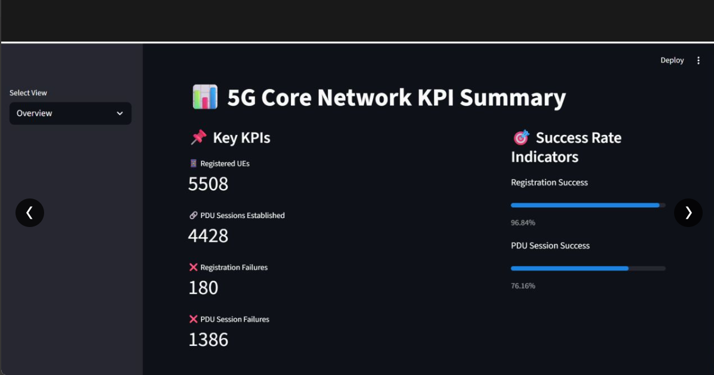
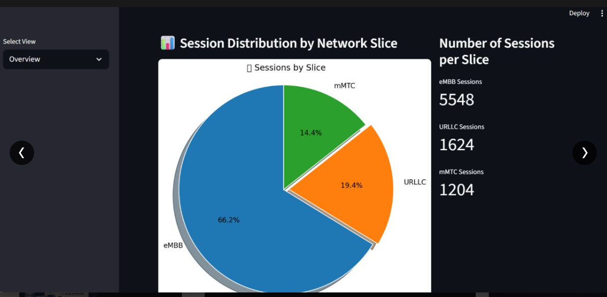
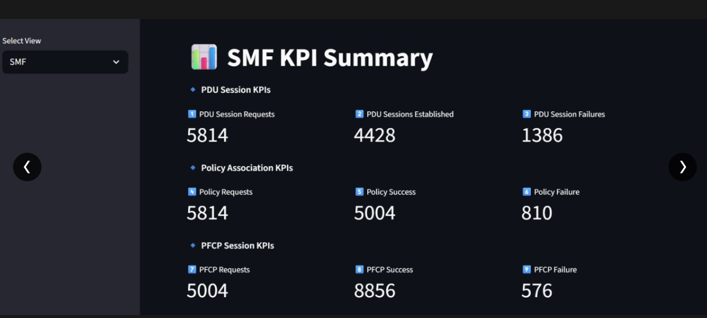
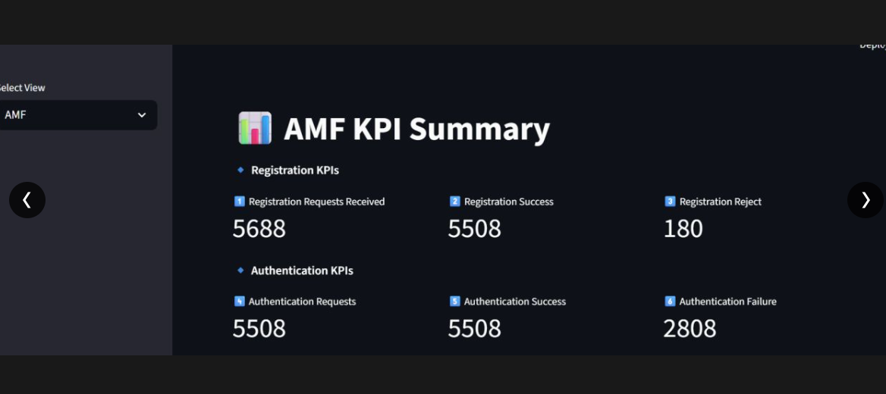
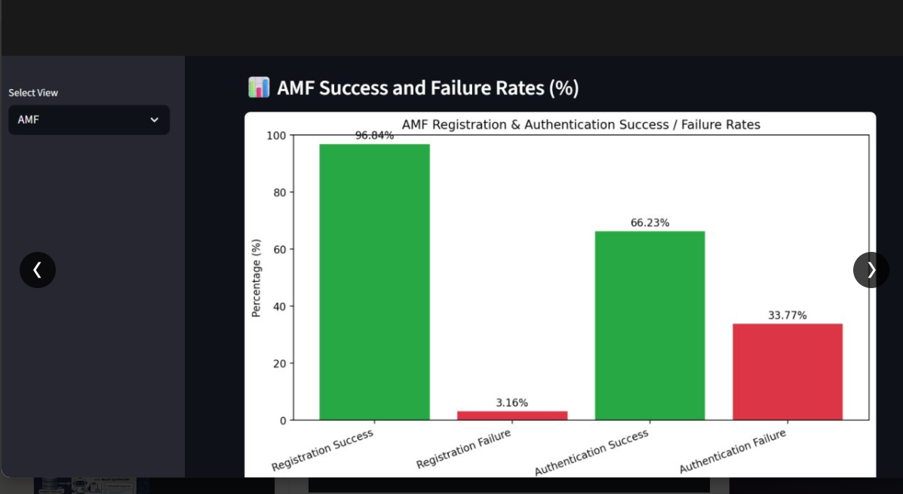
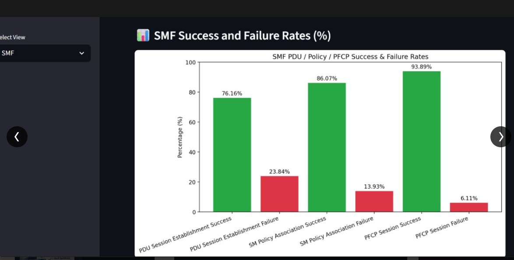

# 5G Core Analytics & Insights Platform

A Python-based analytics system that parses 5G Core Network Function (NF) logs (AMF, SMF), computes key performance indicators (KPIs), and stores them for analysis, visualization, and API-based access.

This project simulates the analytics role of 5G NWDAF by processing AMF/SMF logs, deriving procedure-level KPIs, and providing insights into network and slice performance.

---

## 🚀 Key Features

- 📡 **[AMF KPIs](#amf-kpi-summary)**
  - Registration Requests, Success & Reject counts
  - Authentication Requests, Success & Failure counts

- 🔗 **[SMF KPIs](#smf-kpi-summary)**
  - PDU Session Requests, Established & Failures
  - Policy Association Requests, Success & Failures
  - PFCP Session Requests, Success & Failures

- 🧩 **[Slice-Level (SNSSAI) Analytics](#session-distribution-by-network-slice)**
  - Session count per network slice (eMBB, URLLC, mMTC)
  - Pie chart visualization of slice distribution

- 📊 **[Success/Failure Rate Charts](#success-and-failure-rates)**
  - AMF Registration & Authentication rate visualization
  - SMF PDU / Policy / PFCP rate visualization

- 🗄️ **Persistence Layer**
  - SQLite-based KPI storage
  - Clean schema design with extensibility

- 🧱 **Clean Architecture**
  - Log Parsing → KPI Computation → Database
  - Extensible to FastAPI & Streamlit

---

## 🏗️ Architecture Overview

```text
5G NF Logs (AMF / SMF)
        ↓
Log Parser Layer
        ↓
KPI Computation
        ↓
SQLite Database
        ↓
FastAPI (APIs) / Streamlit (Dashboard)
```

---

## 📸 Dashboard Screenshots

### 5G Core Network KPI Summary

> Overview of key network metrics including registered UEs, PDU sessions, and success rate indicators.



---

### Session Distribution by Network Slice

> Pie chart showing session distribution across eMBB (66.2%), URLLC (19.4%), and mMTC (14.4%) slices.



---

### SMF KPI Summary

> Detailed SMF metrics covering PDU Session, Policy Association, and PFCP Session KPIs.



---

### AMF KPI Summary

> AMF registration and authentication KPIs including request counts, success, and reject numbers.



---

### AMF Success and Failure Rates (%)

> Bar chart showing AMF Registration Success (96.84%), Registration Failure (3.16%), Authentication Success (66.23%), and Authentication Failure (33.77%).



---

### SMF Success and Failure Rates (%)

> Bar chart showing SMF PDU Session Establishment (76.16%), SM Policy Association (86.07%), and PFCP Session (93.89%) success rates.



---

## 🗂️ Project Structure

| Directory / File | Description |
|---|---|
| `log_parser/` | Modules to read and parse AMF/SMF logs and extract KPIs |
| `tools/` | Helper utilities such as log generators for simulating 5G Core NF logs |
| `db/` | Database setup, connection utilities, KPI insertion logic, and DB-level APIs |
| `logs/` | Sample AMF and SMF log files used for KPI extraction and testing |
| `server/` | FastAPI backend for exposing KPIs and analytics via REST APIs |
| `dashboard/` | Streamlit application for visualizing KPIs and network analytics |
| `main.py` | Entry point that orchestrates log parsing, KPI computation, and DB storage |
| `requirements.txt` | Required Python packages |
| `README.md` | Project overview, architecture, and usage instructions |

---

## ⚙️ Setup Instructions

### 1. Clone the repository

```bash
git clone https://github.com/lavanyakusu-arch/5g-core-analytics.git
cd 5g-core-analytics
```

### 2. Install dependencies

```bash
pip install -r requirements.txt
```

### 3. Run the main ingestion script

```bash
python main.py
```

**Sample output:**

```text
INFO | Starting 5G Core Analytics pipeline
INFO | Database initialized successfully
INFO | Log files loaded (AMF=1556 lines, SMF=2094 lines)

INFO | Parsed AMF KPIs:
{'registration_request': 316, 'registration_success': 306, 'authentication_request': 306,
 'authentication_success': 306, 'authentication_failure': 156, 'authentication_retry': 156,
 'registration_reject': 10}

INFO | Parsed SMF KPIs:
{'pdu_session_create_request': 323, 'pfcp_session_establishment_request': 278,
 'pfcp_session_establishment_failure': 32, 'pfcp_session_establishment_response': 492,
 'policy_association_request': 323, 'policy_association_response': 278,
 'policy_association_failure': 45, 'pdu_session_est_complete': 246, 'pdu_session_est_reject': 77}

INFO | Parsed SNSSAI KPIs:
{'1-010203': 1387, '2-020304': 406, '3-030405': 301}

INFO | All KPIs successfully stored in database
INFO | 5G Core Analytics pipeline completed
```

### 4. Run the FastAPI server

```bash
uvicorn server.app:app --reload
```

**Sample output:**

```text
INFO:     Uvicorn running on http://127.0.0.1:8000
INFO:     Application startup complete.
```

### 5. Run the Streamlit dashboard

```bash
streamlit run dashboard/ui_dashboard.py
```

**Sample output:**

```text
You can now view your Streamlit app in your browser.

  Local URL: http://localhost:8501
```

---

## 🛠️ Log Generator (Optional)

The project includes a log generator utility to simulate AMF and SMF logs for testing and demonstration purposes.

```bash
python tools/log_generator.py
```

---

## 📊 KPI Reference

### AMF KPI Summary

| KPI | Value |
|---|---|
| Registration Requests Received | 5688 |
| Registration Success | 5508 |
| Registration Reject | 180 |
| Authentication Requests | 5508 |
| Authentication Success | 5508 |
| Authentication Failure | 2808 |

### SMF KPI Summary

| KPI | Value |
|---|---|
| PDU Session Requests | 5814 |
| PDU Sessions Established | 4428 |
| PDU Session Failures | 1386 |
| Policy Requests | 5814 |
| Policy Success | 5004 |
| Policy Failure | 810 |
| PFCP Requests | 5004 |
| PFCP Success | 8856 |
| PFCP Failure | 576 |

### Session Distribution by Network Slice

| Slice | Sessions | Share |
|---|---|---|
| eMBB | 5548 | 66.2% |
| URLLC | 1624 | 19.4% |
| mMTC | 1204 | 14.4% |
